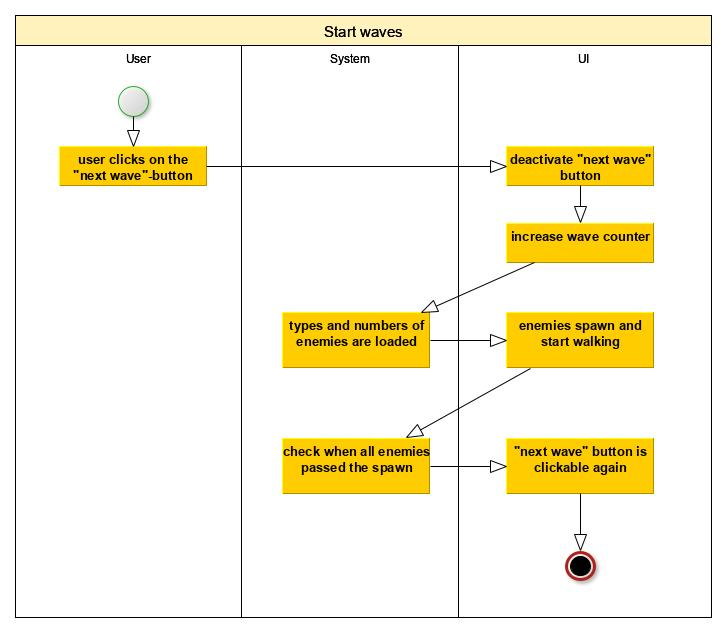
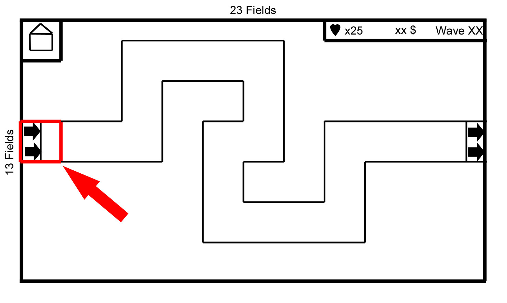

# 1 Use-Case Name: Start waves

## 1.1 Brief Description
Every user can start a wave using a specific button. At this point the map structure is created and displayed. The player looks now at the game activity, where he has multiple possibilities to control the game. One is to start the first wave or the next wave. This option belongs to a button on the first field of the path. There is the spawn point for every enemy but by clicking it, a wave will be started. All enemies from the last wave have to pass the spawn field before another wave can be started.

# 2 Flow of Events
## 2.1 Basic Flow
- User clicks on the “start wave” button in the game
- After clicking the button this will be deactivated
- The wave counter will be increased by one
- The types and numbers of enemies within the wave are loaded
- The enemies start to spawn and walk through the path
- If all enemies pass the spawn point, the button is active again

### 2.1.1 Activity Diagram


### 2.1.2 Mock-up


### 2.1.3 Narrative
```gherkin
Feature: Start a new wave in the game

  Background:
    I started the application
    I started the game by clicking "start game" and choosed a difficulty


  Scenario: open new operation dialog
    Given I am in the game activity and have a running game
    When I press the spawnpoint
    And The last wave completely passed the spwanpoint
    And There is a wave left
    Then The next wave will start
```

## 2.2 Alternative Flows
The first wave has to be started by the described button. All next waves will start automatically with a running timer but by clicking the button they can be started earlier.

# 3 Special Requirements
(n/a)

# 4 Preconditions
## 4.1 Finish of previous Wave
The first wave has to be started manually. For starting the next wave the whole previous wave has to pass the spawnpoint but this is only able if this wave was not the last one.

# 5 Postconditions
(n/a)
 
# 6 Extension Points
(n/a)
