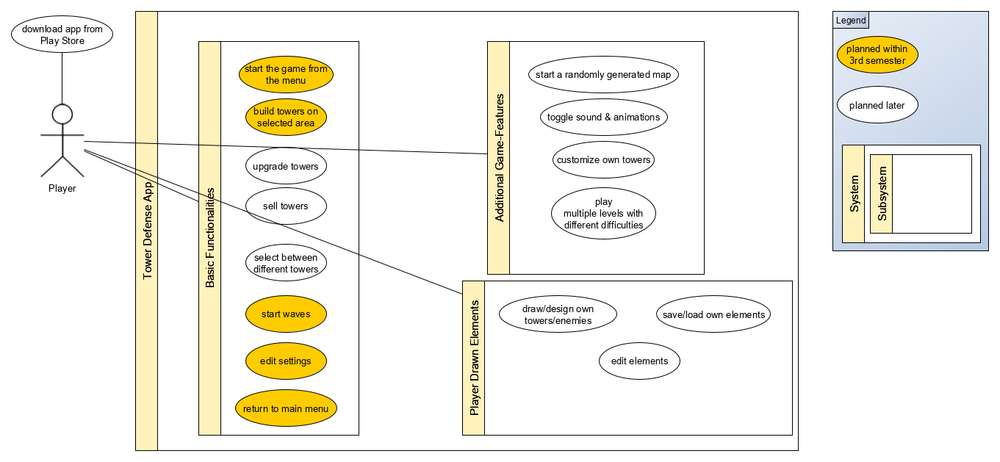

# Tower-Defense - Software Architecture Document

### Version 1.0

# Revision history

| Date       | Version | Description                                          | Author           |
|------------|---------|------------------------------------------------------|------------------|
| 01/12/2019 | 1.0     | Initial Documentation                                | Fabian Braun     |

# Table of Contents
- [Introduction](#1-introduction)
    - [Purpose](#11-purpose)
    - [Scope](#12-scope)
    - [Definitions, Acronyms and Abbreviations](#13-definitions-acronyms-and-abbreviations)
    - [References](#14-references)
    - [Overview](#15-overview)
- [Architectural Representation](#2-architectural-representation)
- [Architectural Goals and Constraints](#3-architectural-goals-and-constraints)
- [Use-Case View](#4-use-case-view)
- [Logical View](#5-logical-view)
    - [Overview](#51-overview)
    - [Architecturally Significant Design Packages](#52-architecturally-significant-design-packages)
- [Process View](#6-process-view)
- [Deployment View](#7-deployment-view)
- [Implementation View](#8-implementation-view)
    - [Overview](#81-overview)
    - [Layers](#82-layers)
- [Data View](#9-data-view)
- [Size and Performance](#10-size-and-performance)
- [Quality/Metrics](#11-qualitymetrics)

## 1. Introduction

### 1.1 Purpose

This document provides a comprehensive architectural overview of our system.

### 1.2 Scope

The Scope of this SAD is to show the architecture from our tower-defense game, we implement as an android application. We show an overview of our Use-Cases and classes.

### 1.3 Definitions, Acronyms and Abbreviations

| Abbreviation | Description                            |
| ------------ | -------------------------------------- |
| API          | Application programming interface      |
| MVC          | Model View Controller                  |
| SRS          | Software Requirements Specification    |
| UC           | Use Case                               |
| VCS          | Version Control System                 |
| N/A          | Not Applicable                         |

### 1.4 References

| Reference                                                                             | Date       | Publishing Team    |
|---------------------------------------------------------------------------------------|------------|--------------------|
| <a href="https://dh-towerdefense.de/">Tower-Defense Blog</a>                          | 02/10/2019 | Team Tower-Defense |
| <a href="http://jira.dh-towerdefense.de/">Jira</a>                                    | 10/10/2019 | Team Tower-Defense |
| <a href="https://github.com/niwa99/Tower-Defense">GitHub</a>                          | 07/10/2019 | Team Tower-Defense |
| <a href="https://github.com/niwa99/Tower-Defense/blob/master/documents/SRS.md">SRS</a>| 20/10/2019 | Team Tower-Defense |

### 1.5 Overview

This document deals with the representation of our architecture, goals and constraints. Other important points are logical, deployment, implementation and data views.

## 2. Architectural Representation

Our application architecture is divided in Model, View and Controller. 
The view receives and visualizes the data from the controller.
The model consists of the logical objects as well as patterns for its attributes. In addition, helper-classes are included in order to support logical features and calculations.
The Controller is a central element which controls the whole application.

The typical Android-MVC-Model is defined as in the following:

## 3. Architectural Goals And Constraints

We are using Java as programming language and Android Studio as programming environment. Due to this fact, most important architectural aspects are covered by our given framework, which makes us able to focus on the game on logical basis.
Looking for architectural goals, an own game-engine was created so that it is easily possible to edit and expand the Tower-Defense application in the future.
Because the whole game-engine is developed by ourselves, we are not explicitly bound to any frameworks (except Android/Java) so that there are not any mentionable constraints existing, except concerning the visualization using activities and their objects.

## 4. Use-Case View

This is our overall use-case diagram:

## 5. Logical View

### 5.1 Overview

We split our architecture according to the MVC architecture as follows:

Currently, we did not finally decide on which dependencies will be needed for our project.
tbd

### 5.2 Architecturally Significant Design Packages

The package de.dhbw.activities contains our view-components which display the functionalities on a device.
In de.dhbw.game, our controller is located.
de.dhbw.map contains the basic game-map-model-files.
In the package de.dhbw.util are further files and helper-classes located which support all components.

## 6. Process View

N/A

## 7. Deployment View

The application is planned to run locally without any connection to servers and databases.

## 8. Implementation View

tbd

## 9. Data View

The data of our application will be stored locally without any external database.

## 10. Size and Performance

As we are developing a game with a lot of objects moving at the same time, it is very important to keep the calculations of movements for enemies or bullets as well as the calculation for the tower focus very fast to prevent lags. Also we use multiple threads for parallel animations. Therefore we need a high Android SDK version which means, there is no support for older devices which don’t support Android 7.0 or higher.

## 11. Quality/Metrics

tbd
