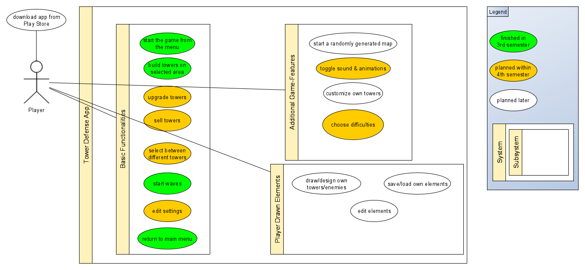

# Tower Defense - Software Requirements Specification

## Table of Contents

-   [1. Introduction](#1-introduction)

    -   [1.1 Purpose](#11-purpose)
    -   [1.2 Scope](#12-scope)
    -   [1.3 Definitions, Acronyms and Abbreviations](#13-definitions-acronyms-and-abbreviations)
    -   [1.4 References](#14-references)
    -   [1.5 Overview](#15-overview)

-   [2. Overall Description](#2-overall-description)

    -   [2.1 Project Vision](#21-project-vision)

-   [2.2 Product perspective](#22-product-perspective)

    -   [2.3 User characteristics](#23-user-characteristics)
    -   [2.4 Dependencies](#24-dependencies)

-   [3. Specific Requirements](#3-specific-requirements)

    -   [3.1 Functionality](#31-functionality)

        -   [3.1.1 Start the game from the menu](#311-start-the-game-from-the-menu)
        -   [3.1.2 Build towers on selected area](#312-build-towers-on-selected-area)
        -   [3.1.3 Upgrade towers](#313-upgrade-towers)
        -   [3.1.4 Sell towers](#314-sell-towers)
        -   [3.1.5 Select between different towers](#315-select-between-different-towers)
        -   [3.1.6 Start waves](#316-start-waves)
        -   [3.1.7 Edit settings](#317-edit-settings)
        -   [3.1.8 Return to main menu](#318-return-to-main-menu)
        -   [3.1.9 Start a randomly generated map](#319-start-a-randomly-generated-map)
        -   [3.1.10 Toggle sound and animations](#3110-toggle-sound-and-animations)
        -   [3.1.11 Customize own towers](#3111-customize-own-towers)
        -   [3.1.12 Play multiple levels with different difficulties](#3112-play-multiple-levels-with-different-difficulties)
        -   [3.1.13 Draw or design own towers or enemies](#3113-draw-or-design-own-towers-or-enemies)
        -   [3.1.14 Save or load own elements](#3114-save-or-load-own-elements)
        -   [3.1.15 Edit elements](#3115-edit-elements)

    -   [3.2 Usability](#32-usability)
    
        -   [3.2.1 Startscreen](#321-startscreen)
        -   [3.2.2 Gamescreen - Structure](#322-gamescreen---structure)
        -   [3.2.3 Gamescreen - Actions](#323-gamescreen---actions)
        -   [3.2.4 Settings Menu](#324-settings-menu)
        -   [3.2.5 Customize Enemies, Towers and the Map](#325-customize-enemies-towers-and-the-map)

    -   [3.3 Reliability](#33-reliability)

        -   [3.3.1 Publishing of Updates](#331-publishing-of-updates)
        -   [3.3.2 Availability](#332-availability)

    -   [3.4 Performance](#34-performance)

    -   [3.5 Supportability](#35-supportability)

    -   [3.6 Design Constraints](#36-design-constraints)

    -   [3.7 Online User Documentation and Help System Requirements](#37-online-user-documentation-and-help-system-requirements)

    -   [3.8 Purchased Components](#38-purchased-components)

    -   [3.9 Interfaces](#39-interfaces)

        -   [3.9.1 User Interfaces](#391-user-interfaces)
        -   [3.9.2 Hardware Interfaces](#392-hardware-interfaces)
        -   [3.9.3 Software Interfaces](#393-software-interfaces)
        -   [3.9.4 Communications Interfaces](#394-communications-interfaces)

    -   [3.10 Licensing Requirements](#310-licensing-requirements)

    -   [3.11 Legal, Copyright and other Notices](#311-legal-copyright-and-other-notices)

    -   [3.12 Applicable Standards](#312-applicable-standards)

-   [4. Supporting Information](#4-supporting-information)

## 1. Introduction

### 1.1 Purpose

This document provides a general overview and a detailed description of the Tower-Defense project. In order of achieving this, it explains the vision or rather the purpose and all the features of the product. This document offers insights into the single steps of the project-development.

### 1.2 Scope

The document should be used for internal purposes only.

### 1.3 Definitions, Acronyms and Abbreviations

| Term     |                                     |
| -------- | ----------------------------------- |
| **SRS**  | Software Requirements Specification |
| **TD**   | Tower Defense                       |
| **UCD**  | Use Case Diagram                    |
| **FPS**  | Frames Per Second                   |
| **tbd**  | to be determined                    |

### 1.4 References

| Title                                                                                                               | Date       |
| ------------------------------------------------------------------------------------------------------------------- | ---------- |
| [Blog](https://dh-towerdefense.de/)                                                                                 | 20/10/2019 |
| [GitHub](https://github.com/niwa99/Tower-Defense)                                                                   | 20/10/2019 |
| [Jira](http://jira.dh-towerdefense.de)                                                                              | 20/10/2019 |
| [Use Case Diagram](https://github.com/niwa99/Tower-Defense/blob/master/documents/UCS/UseCaseDiagram-2020-04-23.png) | 23/04/2020 |

### 1.5 Overview

Beside a conceptional overview of the project, the perspective on single requirements are demonstrated within the following chapters.

## 2. Overall Description

### 2.1 Project Vision

After two semesters of development, an Android Tower-Defense-game-app with the following functionalities should be designed.
Beginning on a startscreen, one can start the Tower-Defense-game. Being on the game-screen, one will be able to see a grid consisting of many tiles. Some tiles are protected and represent the way which enemies will walk on and some tiles will be editable so that a player can build towers on it.
The whole game consists of “waves”. In a wave, a specific amount of enemies approach and try to reach the goal. The player needs to build towers so that enemies become killed before they reach the goal.
Probably, there will be different enemies with certain speed and health points. Also, it is planned to have different towers which distinguish in their fire rate, range and strength.
On top of those basic features, custom editing functionalities for enemies, towers and the map-structure are planned.

## 2.2 Product perspective

Our Use-Case-Diagram

### 2.3 User characteristics

Our target group is pretty wide-ranging from teenagers up to older adults. In order to have fun playing this game, tactical thinking is required. Different levels provide a great challenge for people at any age.

### 2.4 Dependencies

Tower Defense does not require any additional software. One will be able to download the app from a website or from the Google Play Store which only requires a current smartphone running Android 7.0 or higher.

## 3. Specific Requirements

### 3.1 Functionality

#### 3.1.1 Start the game from the menu

The game should be started from the start screen using a button.
[UC Specification](./UCS/UCS-Start_The_Game_From_The_Menu/UCS-Start_The_Game_From_The_Menu.md)

#### 3.1.2 Build towers on selected area

Towers need to be placed on the game grid in order to kill enemies. Therefore, one can click on a tile which opens a menu for building a tower.
[UC Specification](./UCS/UCS-Build_Towers_On_Selected_Area/UCS-Build_Towers_On_Selected_Area.md)

#### 3.1.3 Upgrade towers

Clicking on a tower, a menu should pop up which lets a user upgrade a tower for a specific amount of money. Probably, an upgrade influences the range, the fire rate and the damage of a tower.
[UC Specification](./UCS/UCS-Upgrade_Towers/UCS-Upgrade_Towers.md)

#### 3.1.4 Sell towers

Clicking on a tower, a menu should pop up in which one can choose to sell the tower.
[UC Specification](./UCS/UCS-Sell_Towers/UCS-Sell_Towers.md)

#### 3.1.5 Select between different towers

In the future, there will be different kind of towers which have different values and abilities.
[UC Specification](./UCS/UCS-Select_Between_Different_Towers/UCS-Select_Between_Different_Towers.md)

#### 3.1.6 Start waves

Using a button (or after a specific time), a wave can be started which makes enemies approaching.
[UC Specification](./UCS/UCS-Start_Waves/UCS-Start_Waves.md)

#### 3.1.7 Edit settings

Settings will be editable in an own menu.
[UC Specification](./UCS/UCS-Edit_Settings/UCS-Edit_Settings.md)

#### 3.1.8 Return to main menu

While being on the game screen, a button can be used in order to go back to the start screen.
[UC Specification](./UCS/UCS-Return_To_Main_Menu/UCS-Return_To_Main_Menu.md)

#### 3.1.9 Start a randomly generated map

Using a button labeled as "Random", a randomly generated map will be created and can be played.

#### 3.1.10 Toggle sound and animations

There will be two buttons which let a player toggle sounds and animations.
[UC Specification](./UCS/UCS-Toggle_Sound_And_Animations/UCS-Toggle_Sound_And_Animations.md)

#### 3.1.11 Customize own towers

This functionality allows users to create and design their own tower with given patterns.

#### 3.1.12 Play multiple levels with different difficulties

One can choose between three difficulties: Easy, Medium and Hard. This choice influences tower- and enemy-attributes.
[UC Specification](./UCS/UCS-Choose_Difficulties/UCS-Choose_Difficulties.md)

#### 3.1.13 Draw or design own towers or enemies

Own towers and enemies can be drawn on a separate screen by hand. This functionality makes the game highly customizable.

#### 3.1.14 Save or load own elements

In a separate menu, one can choose between the standard towers/enemies and the custom towers/enemies for the next games.

#### 3.1.15 Edit elements

Custom enemies and towers can be edited in a specific screen. This functionality is connected to "draw/design own towers/elements".

### 3.2 Usability

The Android application will not require any practice or tutorial because of its user-friendly design.
The following screen flow explains the structure of the app.

#### 3.2.1 Startscreen

The start screen functions as a landing page when opening the app. It should contain a gameplay image as background, a “start” button which forwards to the game page and a menu button which will pop up a settings-menu.

#### 3.2.2 Gamescreen - Structure

The gamescreen shows the map, a button for the settings menu and a top bar with some game information (lives, money, …).

#### 3.2.3 Gamescreen - Actions

A player should be able to build, remove and upgrade towers. Those actions should be doable by clicking on a map-tile. Moreover, a button for skipping to the next wave could be useful.

#### 3.2.4 Settings Menu

tbd

#### 3.2.5 Customize Enemies, Towers and the Map

tbd

### 3.3 Reliability

#### 3.3.1 Publishing of Updates

Updates may only become published if all new features have been tested in order to guarantee full functionality. Updates will never be mandatory.

#### 3.3.2 Availability

Due to the fact that Tower Defense becomes published in the Google Play Store, the availability belongs to Google. For playing the game, network connection is not required.

### 3.4 Performance

The app must be runnable fluently (FPS: 30 or more) on current Android devices.
tbd

### 3.5 Supportability

Common conventions (such as Java conventions) are used.
While having code reviews, the quality of code is kept high.

### 3.6 Design Constraints

Tower Defense is developed with Java, XML and the Android framework wherefore the app will only be runnable on Android devices.
Developing the app, the team makes use of Git and GitHub for version controlling, Android Studio as development environment, Jira for project management, Adobe Photoshop Elements 12 for designs and yEd Graph Editor for modelling processes.

### 3.7 Online User Documentation and Help System Requirements

N/A

### 3.8 Purchased Components

Since we create our app including the designs completely by ourselves, there is no need for any commercial licenses or components except the Google Developers Account in order to publish the app in the Google Play Store.

### 3.9 Interfaces

#### 3.9.1 User Interfaces

tbd

#### 3.9.2 Hardware Interfaces

tbd

#### 3.9.3 Software Interfaces

tbd

#### 3.9.4 Communications Interfaces

tbd

### 3.10 Licensing Requirements

tbd

### 3.11 Legal, Copyright and other Notices

tbd

### 3.12 Applicable Standards

tbd

## 4. Supporting Information

tbd
