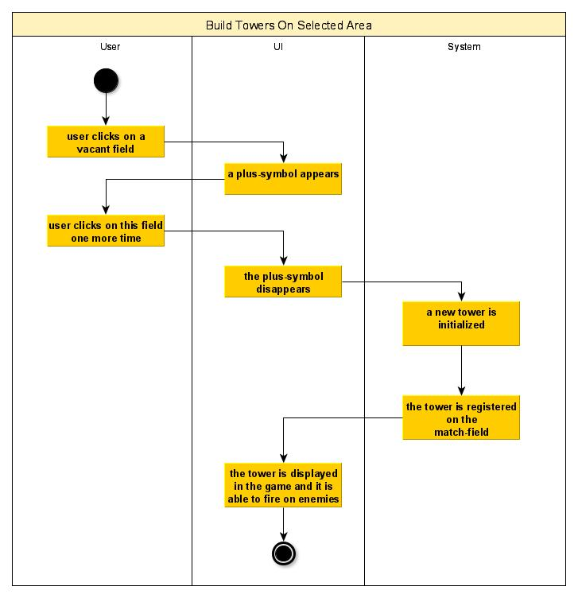
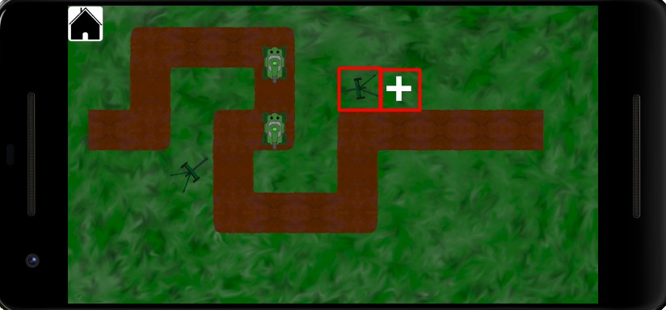

# 1 Use-Case Name: Build towers on selected area

## 1.1 Brief Description
While playing a game, a player needs to build towers in order to fight against enemies. The match-field is structured as a map with predefined fields. When a player clicks on such a field, a plus-sign should appear so that the player knows that he clicked the field. Clicking one more time, a tower should be built on this field and fire at approaching enemies.

# 2 Flow of Events
## 2.1 Basic Flow
- User is on the game page and clicks a field
- A plus sign is displayed on the clicked field
- User clicks on the field one more time
- A tower is built on this field and the plus-symbol disappears
- The tower is able to fire at enemies

### 2.1.1 Activity Diagram


### 2.1.2 Mock-up


### 2.1.3 Narrative
```gherkin
Feature: Build towers on selected area

  Background:
    I started the application and started a game

  Scenario: build a tower on a vacant field
    Given I am on the game page
    When I click on a vacant field
    Then a plus-symbol appears on this field
    When I click on this field one more time
    Then the plus-symbol disappears
    And a tower appears on this field

  Scenario: cancel the build-process
    Given I am on the game page
    When I click on a vacant field
    Then a plus-symbol appears on this field
    When I click on another field
    Then the plus-symbol disappears and it appears on the just selected field
    And the before-clicked field is empty again
 
  Scenario: click on an occupied field
    Given I am on the game page
    When I click on an occupied field
    Then nothing happens
```

## 2.2 Alternative Flows
(n/a)

# 3 Special Requirements
(n/a)

# 4 Preconditions
## 4.1 Starting the application
The user has to start the app, start a game and he needs to be on the game-page.

# 5 Postconditions
(n/a)
 
# 6 Extension Points
Instead of showing the plus-symbol, one could display a popup-menu which allows to choose between different towers.
