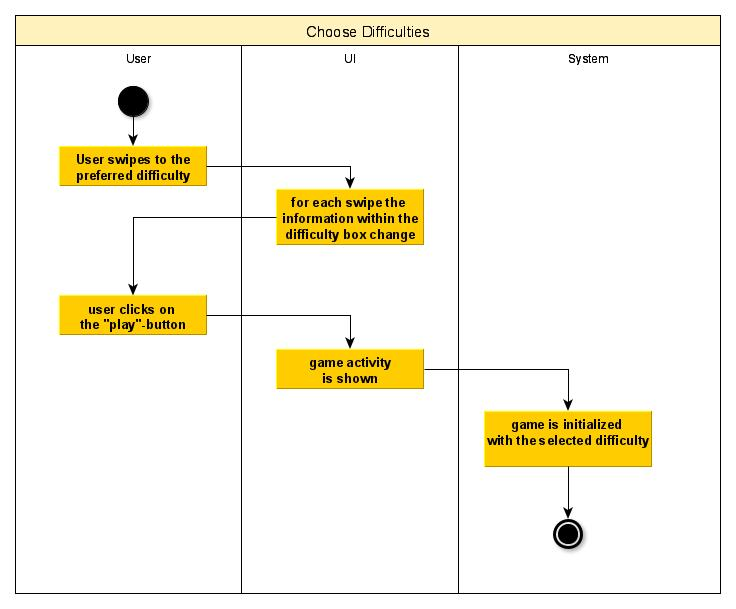
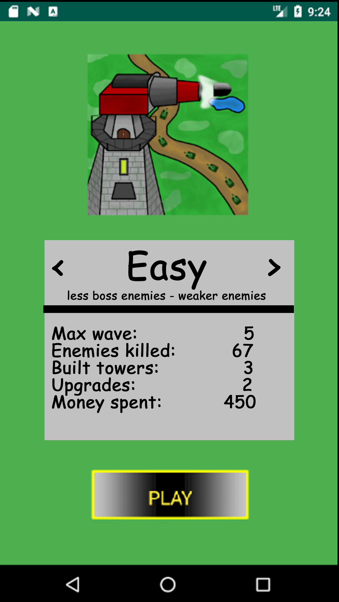

# 1 Use-Case Name: Choose Difficulties

## 1.1 Brief Description
Every user can start the game from the menu page using the play button.
There will be an opportunity to decide between three different difficulties.
The difficulties can vary e.g. in strength, speed or amount of enemies.

# 2 Flow of Events
## 2.1 Basic Flow
- the user swipes through the difficulties
- with every swipe the information in the difficulty box change
- when a difficulty is chosen the user clicks on the play button

### 2.1.1 Activity Diagram

### 2.1.2 Mock-up

### 2.1.3 Narrative
(n/a)

## 2.2 Alternative Flows
The user can start the game without swiping, then the default difficulty is "easy".
The user can quit the app, then the app is closed.

# 3 Special Requirements
(n/a)

# 4 Preconditions
## 4.1 Starting the application
The user has to start the app and he has to be at the main menu.

# 5 Postconditions
(n/a)
 
# 6 Extension Points
(n/a)
