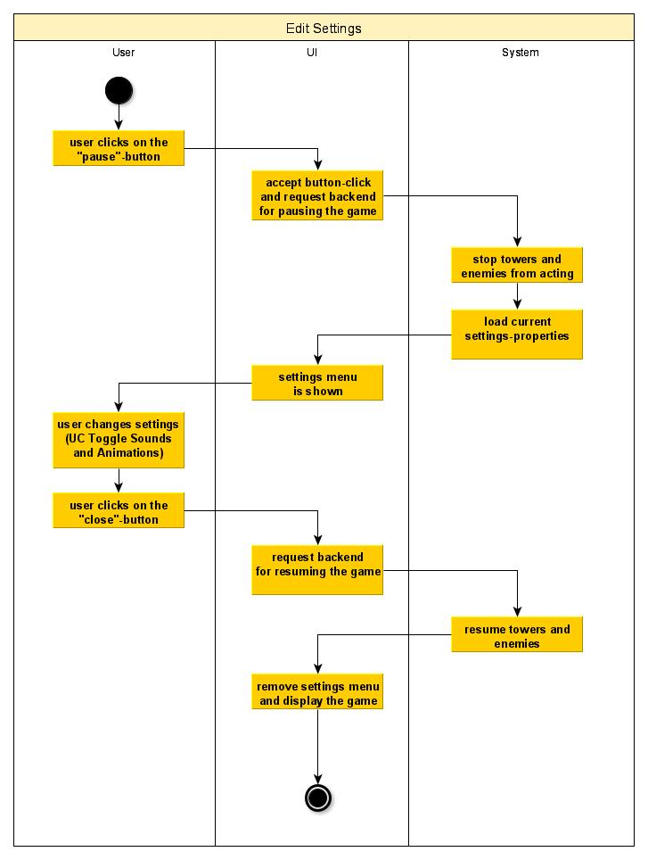
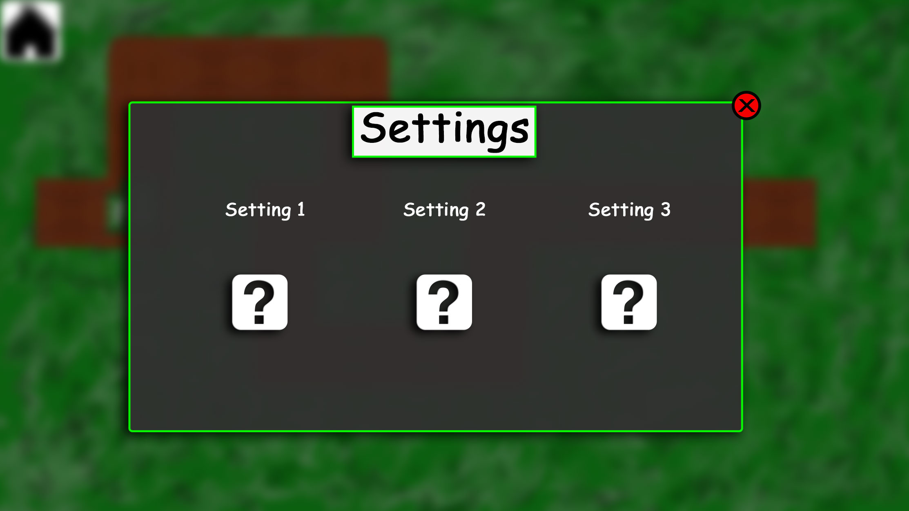

# 1 Use-Case Name: Edit Settings

## 1.1 Brief Description
There will be many different possibilities of adjusting the game according to a user's wishes. In order to let a user change certain settings, a menu is needed in which those settings are adjustable.
When clicking on the "home"- or "pause" button (left at the top), a menu pops up which allows a user to modify settings by clicking on several icons.
For example, there could be some settings for muting the sound or stopping game-animations.
Using the "close"-button right at the top, a user can return to the game.
While being in the settings-menu, the game should be paused.

# 2 Flow of Events
## 2.1 Basic Flow
- user clicks on the "pause"-button
- the game becomes paused and a menu with the current settings pops up
- user changes settings
- user closes the settings-menu and the game is resumed

### 2.1.1 Activity Diagram

### 2.1.2 Mock-up

### 2.1.3 Narrative
(n/a)

## 2.2 Alternative Flows
The user can open and close the settings menu without changing any settings.
In the settings menu includes a button to leave game to the main menu

# 3 Special Requirements
(n/a)

# 4 Preconditions
## 4.1 Game has to be started
As the settings are just callable by using the "pause"-button from ingame, a game has to be started.

# 5 Postconditions
(n/a)
 
# 6 Extension Points
(n/a)
