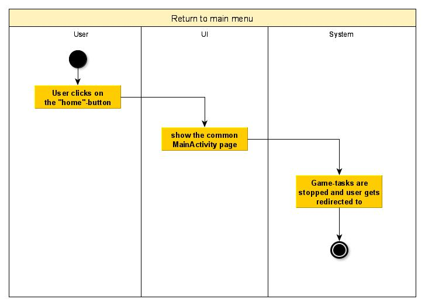

# 1 Use-Case Name: Return to main menu

## 1.1 Brief Description
While playing a game, a user should be able to return to the main menu in order to stop the current game. Such a possibility will be realized through clicking a button which is located in the upper left corner. If a player clicks this button, the whole current game will be completely stopped so that the player cannot return to this game anymore.

# 2 Flow of Events
## 2.1 Basic Flow
- User clicks on a button in the upper left corner while being in a game
- Game-tasks are stopped
- GameActivity gets closed
- User is redirected to the MainActivity
- The MainActivity displays its common functionalities

### 2.1.1 Activity Diagram


### 2.1.2 Mock-up


### 2.1.3 Narrative
```gherkin
Feature: Return To Main Menu

  Background:
    I started the application and a game

  Scenario: return to the main menu
    Given I am on the game page
    When I press the home button
    Then the main page is loaded
```

## 2.2 Alternative Flows
(n/a)

# 3 Special Requirements
(n/a)

# 4 Preconditions
## 4.1 Starting the application
The user has to start the app, start a game and he needs to be on the game-page.

# 5 Postconditions
(n/a)
 
# 6 Extension Points
For the future, a confirmation-popup would be useful so that the player is not instantly redirected to the main page.
Using this extension, one could provide clicking on the home-button by mistake.