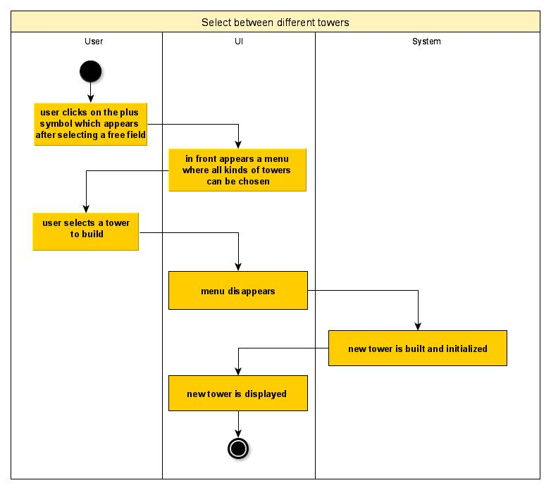
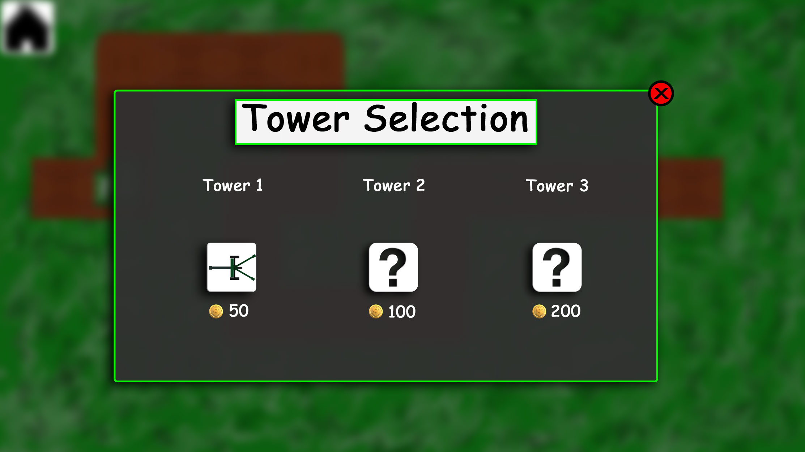

# 1 Use-Case Name: Select between different Towers

## 1.1 Brief Description
By clicking on a free field, there appears a plus symbol. A second click opens a menu for the type selection of a tower
- there is a button for each tower
- above the buttons, the tower names are displayed
- under the buttons you can see the costs of the specific tower
- by choosing one of the towers, a new tower of the chosen type is built on the selected field
- money is decreased by the price of the tower

# 2 Flow of Events
## 2.1 Basic Flow
- User clicks on the plus symbol, which appears on a selected field
- a menu pops up where the type of tower can be selected
- user can only chose towers, when he has enough money
- user selects a type
- the tower is built
- menu is closed

### 2.1.1 Activity Diagram

### 2.1.2 Mock-up

### 2.1.3 Narrative
(n/a)

## 2.2 Alternative Flows
- User clicks on the plus symbol, which appears on a selected field
- a menu pops up where the type of tower can be selected
- user cancels dialog
- menu is closed

# 3 Special Requirements
(n/a)

# 4 Preconditions
## 4.1 A free field has to be selected
For opening the tower selection menu, a free field has to be selected. A selected field is displayed by a plus symbol.
Every tower can only be built, when the player has enough money.

# 5 Postconditions
(n/a)
 
# 6 Extension Points
(n/a)
