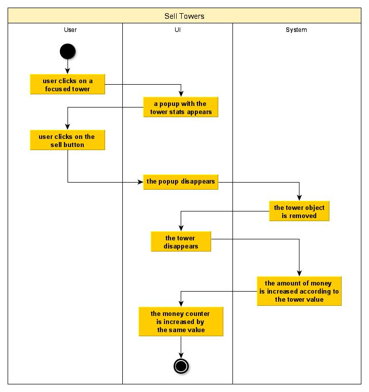
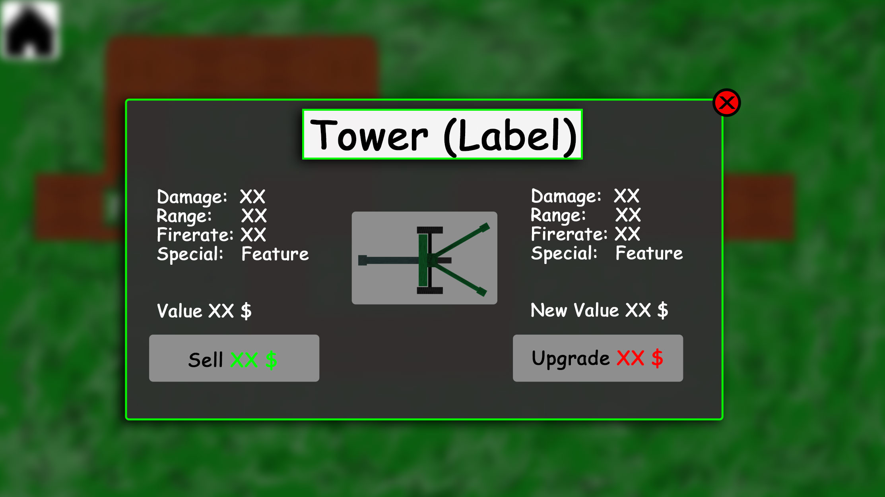

# 1 Use-Case Name: Sell Towers

## 1.1 Brief Description
Every built tower can be sold. When selling a tower, the following steps happen:
- the tower disappears
- the field changes to a "free"-field
- some of the tower costs are refund

# 2 Flow of Events
## 2.1 Basic Flow
- User clicks on an already focused tower
- a popup menu opens which contains the tower stats, the upgraded tower stats and the option to sell the tower
- User clicks on the sell button
- the popup disappears
- the tower disappears
- the ingame money increases according to the value of the sold tower

### 2.1.1 Activity Diagram

### 2.1.2 Mock-up

### 2.1.3 Narrative
(n/a)

## 2.2 Alternative Flows
(n/a)

# 3 Special Requirements
(n/a)

# 4 Preconditions
## 4.1 A tower has to be built
Before it is possible to sell a tower it is necessary to build at least one tower.

## 4.2 A tower must be selected
To open the necessary popup for selling a tower, the tower has to be focused by clicking on it.
The focus is recognizable by the displayed range of the tower.
Click once more on the selected tower to open the tower information popup.

# 5 Postconditions
(n/a)
 
# 6 Extension Points
(n/a)