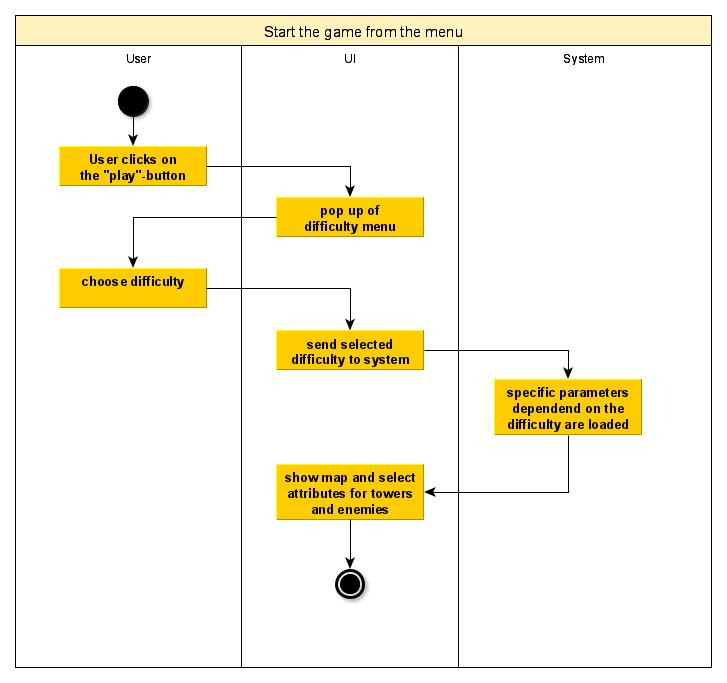
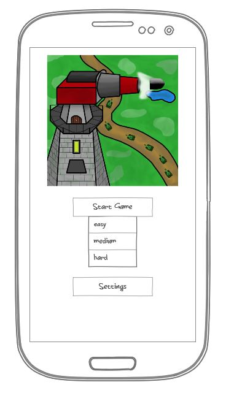

# 1 Use-Case Name: Start the game from the menu

## 1.1 Brief Description
Every user can start the game from the menu page using a specific button. There will be an opportunity to decide between three different difficulties for the game. After  choosing the difficulty, the game page is initialized. At this point the map structure is created and will be displayed. The player looks now at the game activity, where he has multiple possibilities to control the game.

# 2 Flow of Events
## 2.1 Basic Flow
- User clicks on “start game” at the main menu
- An dialog opens where the user can choose the difficulty
- The game is loaded with parameters of the chosen difficulty
- The player is redirected to the game activity
- The map structure is generated and displayed

### 2.1.1 Activity Diagram


### 2.1.2 Mock-up


### 2.1.3 Narrative
```gherkin
Feature: Start the game from the menu

  Background:
    I started the application

  Scenario: start a game with easy settings
    Given I am on the "main" page
    When I press the "start game" button
    Then I am on the "choose difficulty" dropdown
    And I choose "easy" by clicking on it
    Then I am on the "game" page
    And the map with easy settings is loaded

  Scenario: start a game with medium settings
    Given I am on the "main" page
    When I press the "start game" button
    Then I am on the "choose difficulty" dropdown
    And I choose "medium" by clicking on it
    Then I am on the "game" page
    And the map with medium settings is loaded
 
  Scenario: start a game with hard settings
    Given I am on the "main" page
    When I press the "start game" button
    Then I am on the "choose difficulty" dropdown
    And I choose "hard" by clicking on it
    Then I am on the "game" page
    And the map with hard settings is loaded
```

## 2.2 Alternative Flows
(n/a)

# 3 Special Requirements
(n/a)

# 4 Preconditions
## 4.1 Starting the application
The user has to start the app and he has to be at the menu page.

# 5 Postconditions
(n/a)
 
# 6 Extension Points
An Extension could be the choice between different levels (maps), where the player can go through. Generating random maps could also be a point.
-> For this extension another activity to set up the game would be useful, but is not required in the beginning
