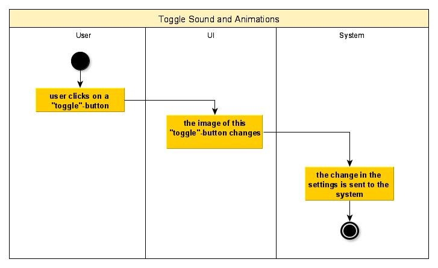
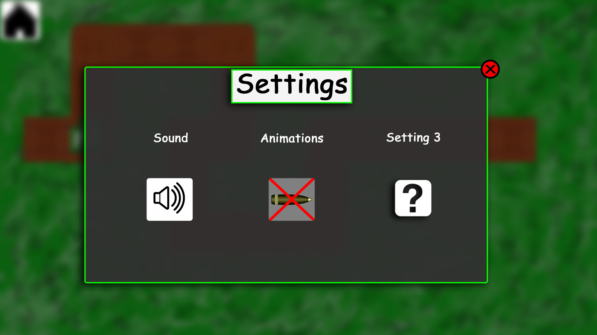

# 1 Use-Case Name: Edit Settings

## 1.1 Brief Description
In Order to change some game settings a settings window is provided.
Within this window users are able to toggle ingame sound and animations.
Toggling the sound changes if the ingame music is played or not.
Toggling the animations changes if animations like bullets are shown or not.

# 2 Flow of Events
## 2.1 Basic Flow
- user clicks on a "toggle"-button
- the image of the "toggle"-button changes
- the information is send to the system

### 2.1.1 Activity Diagram

### 2.1.2 Mock-up

### 2.1.3 Narrative
(n/a)

## 2.2 Alternative Flows
The user can open and close the settings menu without changing any settings.
In the settings menu includes a button to leave game to the main menu

# 3 Special Requirements
(n/a)

# 4 Preconditions
## 4.1 Game has to be started
As the settings are just callable by using the "pause"-button from ingame, a game has to be started.

# 5 Postconditions
(n/a)
 
# 6 Extension Points
(n/a)
