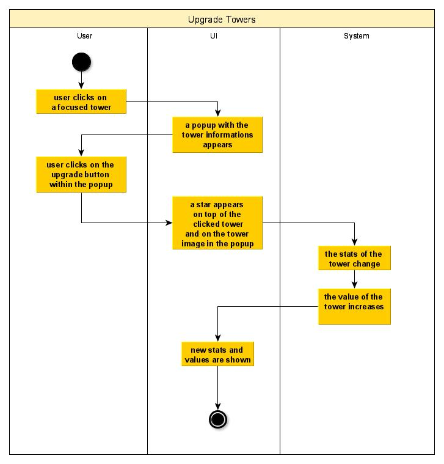
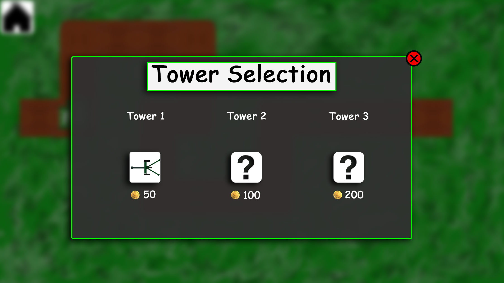

# 1 Use-Case Name: Upgrade Towers

## 1.1 Brief Description
Every built tower can be upgraded in order to increase some of the stats of this tower.
For upgrading a tower ingame, money is needed.
Visually, such upgrades should be recognizable by stars which are located on top of a tower.

# 2 Flow of Events
## 2.1 Basic Flow
- User clicks on a built tower
- a button for upgrading this tower appears
- User clicks on this button
- the button disappears
- a golden star appears on top of the tower image as sign that this tower is upgraded once

### 2.1.1 Activity Diagram

### 2.1.2 Mock-up

### 2.1.3 Narrative
(n/a)

## 2.2 Alternative Flows
- if the tower is already once upgraded, there will be a golden star added when upgrading the tower
- if the tower is upgraded three times, the upgrade button will no longer appear so it is not possible to upgrade the tower once more

# 3 Special Requirements
(n/a)

# 4 Preconditions
## 4.1 A tower has to be built
Before it is possible to upgrade a tower it is necessary to build at least one tower

## 4.1 Necessary money is needed
Before it is possible to upgrade a tower it is necessary to have enough money to buy the upgrade

# 5 Postconditions
(n/a)
 
# 6 Extension Points
(n/a)
