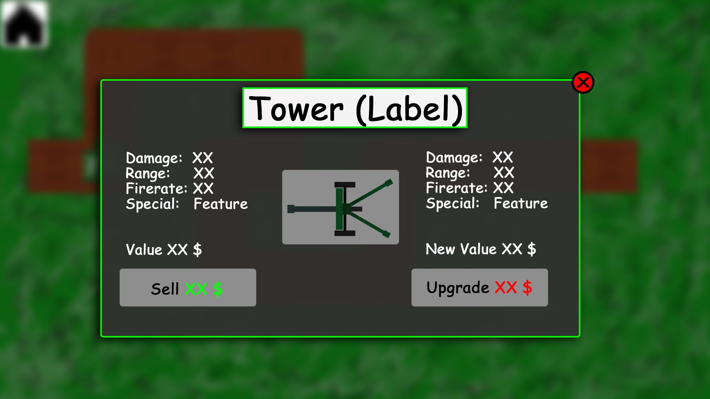

# 1 Use-Case Name: Upgrade Towers

## 1.1 Brief Description
Every built tower can be upgraded in order to increase some of the stats of this tower.
For upgrading a tower ingame, money is needed.
Visually, such upgrades should be recognizable by stars which are located on top of a tower.

# 2 Flow of Events
## 2.1 Basic Flow
- User clicks twice on a built tower
- a popup with the tower stats, the upgraded tower stats and the option to sell the tower opens
- User clicks on the upgrade button
- a star appears on top of the clicked tower and on the tower image in the popup
- the stats of the tower increase
- the value and the new value of the tower increase
- the new values are shown in the popup

### 2.1.1 Activity Diagram

### 2.1.2 Mock-up

### 2.1.3 Narrative
(n/a)

## 2.2 Alternative Flows
- if the tower is already once upgraded, there will be a golden star added when upgrading the tower
- if the tower is already upgraded up to its maximum level, the upgrade button will no longer appear so it is not possible to upgrade the tower once more

# 3 Special Requirements
(n/a)

# 4 Preconditions
## 4.1 A tower has to be built
Before it is possible to upgrade a tower it is necessary to build at least one tower

## 4.2 Necessary money is needed
Before it is possible to upgrade a tower it is necessary to have enough money to buy the upgrade

## 4.3 A tower must be selected
To open the necessary popup for upgrading a tower, this have to be selected by clicking on it.
Click once more on the selected tower to open the tower information popup.

# 5 Postconditions
(n/a)
 
# 6 Extension Points
(n/a)
